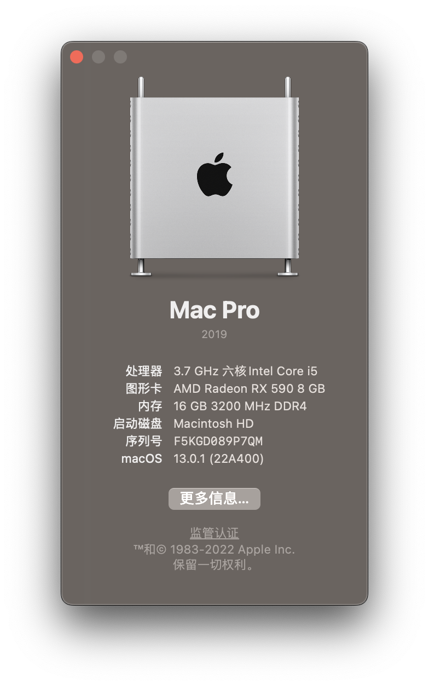
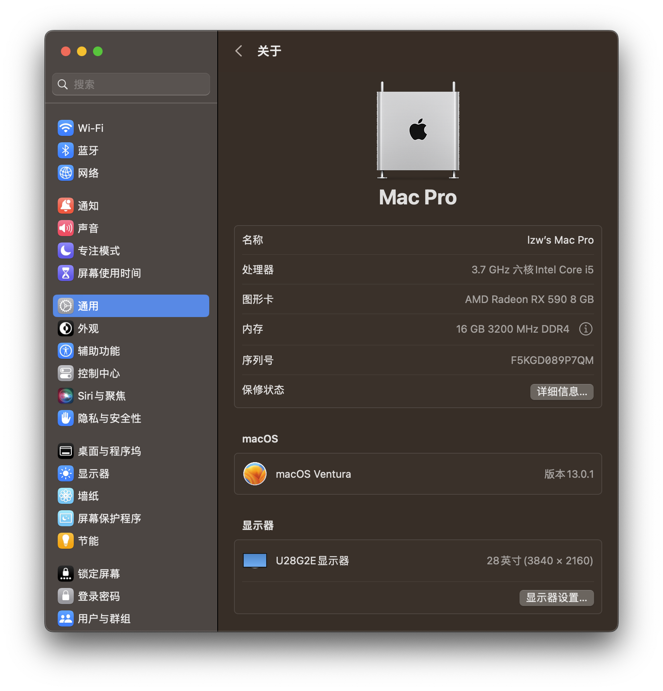
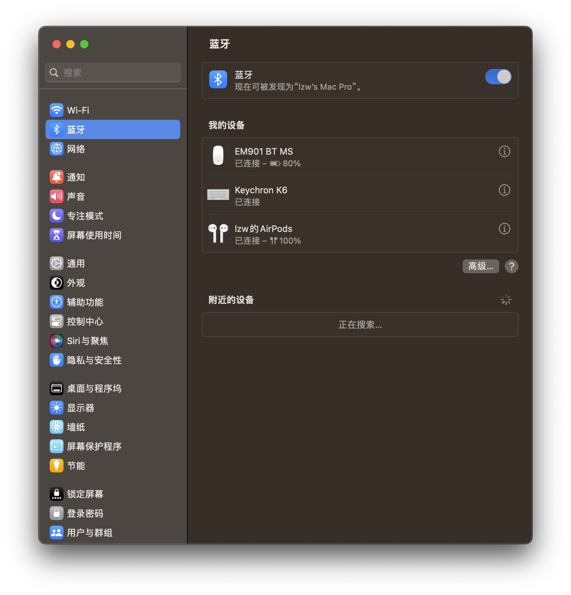
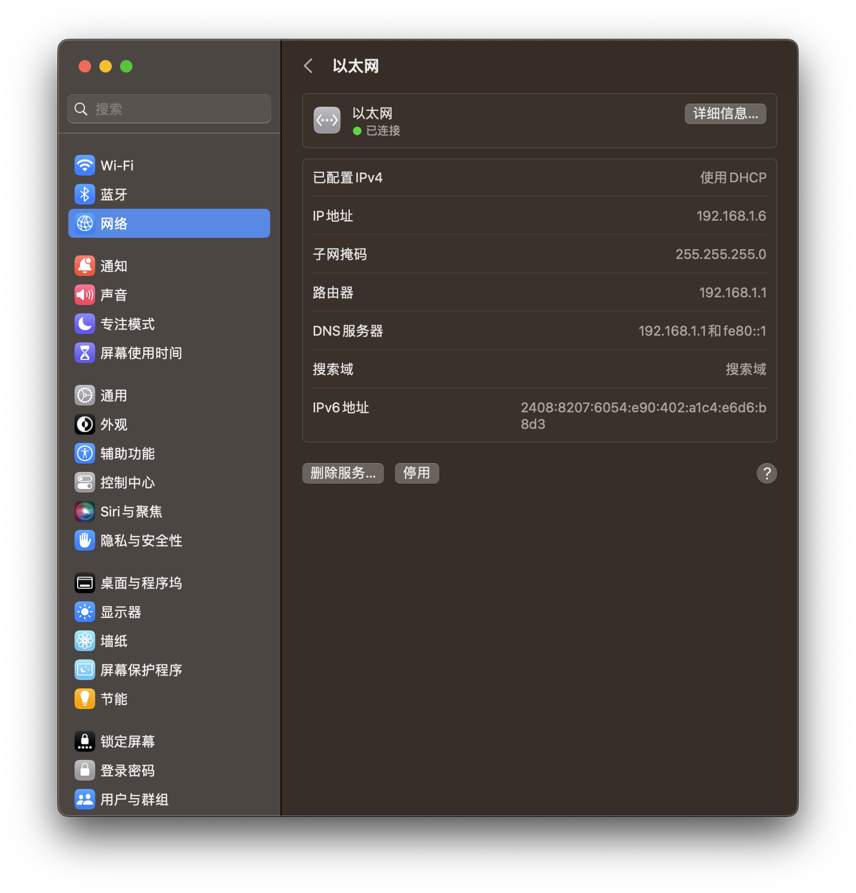
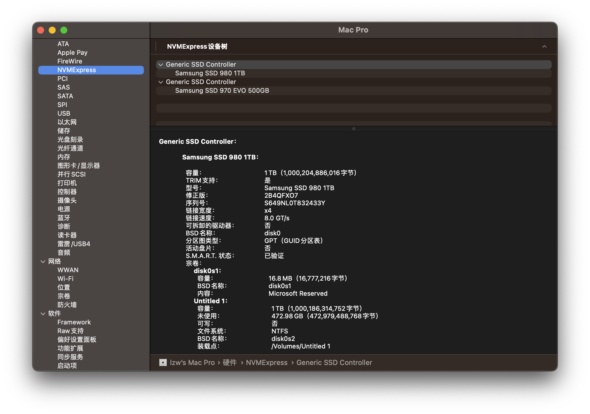

# 软件信息
- OC版本： 0.8.6
- 操作系统：macos ventrura 13.0.1
- SMBIOS: MacPro7,1 (Mac Pro 2019)
# 硬件信息
- 主板: MSI Z390 Gaming Carbon Pro
- CPU: i5-9600KF
- 内存: 金士顿 8G*2 3200
- 显卡: 蓝宝石RX590 超白金
- wifi: 无（有线连接）
- 蓝牙: 胜为USB蓝牙UDC-328B

# 成品

